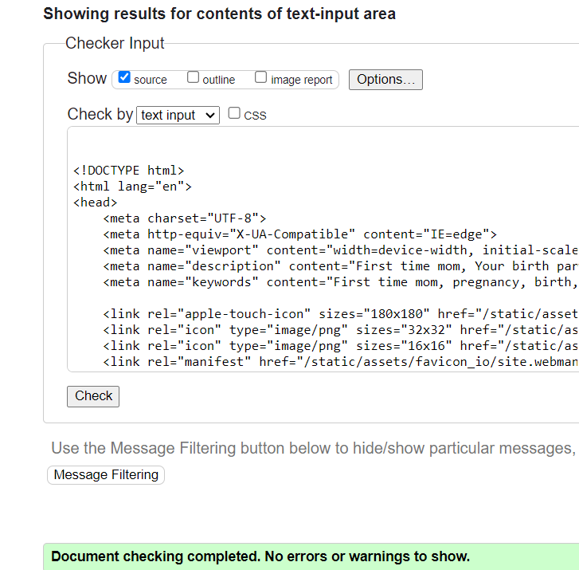
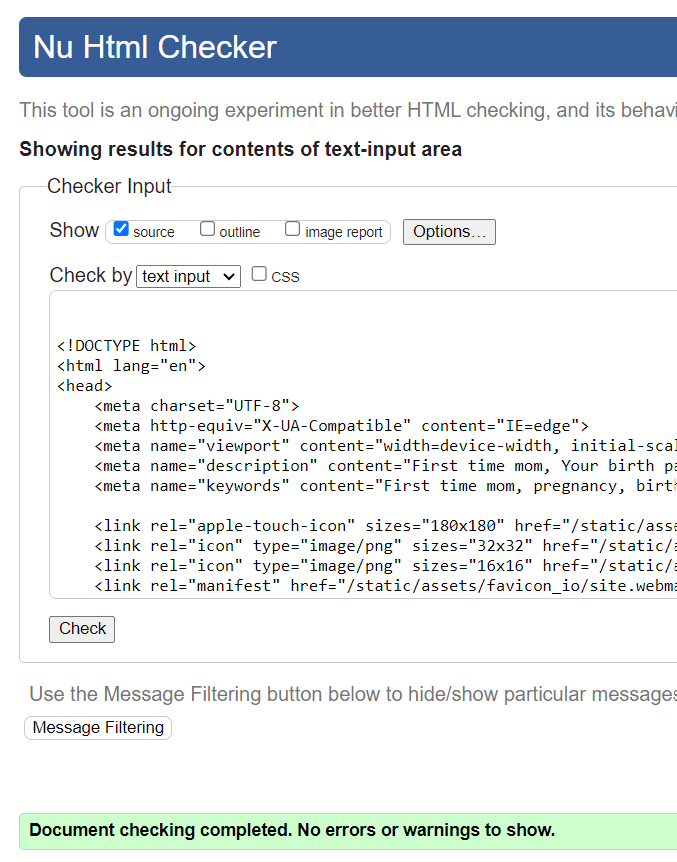
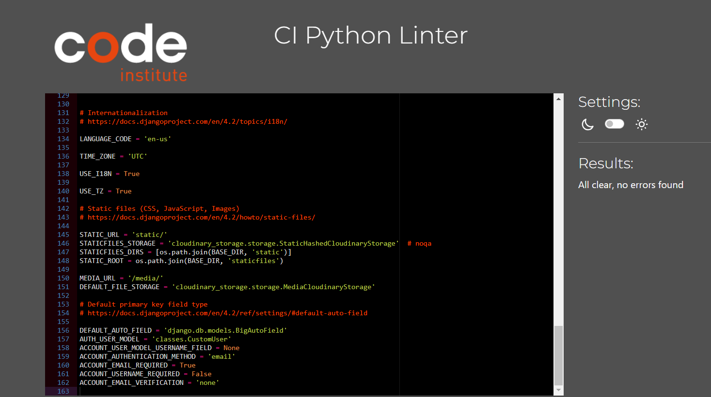
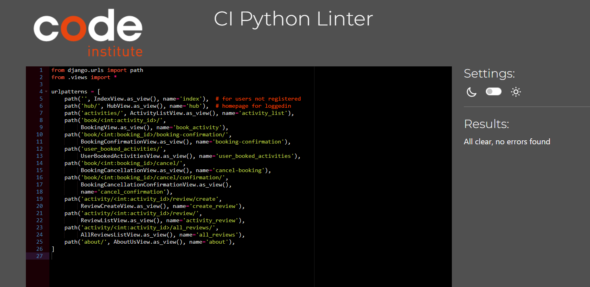

# Introduction 

**First time mom** is an innovative and user friendly application, that offers support, through activities, to new moms trying to navigate their pregnancy journey as they prepare to welcome their little ones. This web-based application allows users to book and/or cancel different activities. Check out the application [here](first-time-mom-67725208182a.herokuapp.com)

# Table of Contents
1. [Project Goals](#project-goals)
    - [Site Owner Goals](#site-owner-goal)
    - [User Goals](#user-goals)
2. [User Experience](#user-experience)
    - [Target Audience](#target-audience)
    - [User Stories](#user-stories)   
3. [Design](#design)
    - [Colour](#colour)
    - [Typography](#typography)
4. - [Wireframes](#wireframes)
5. - [Features](#features)
6. - [Testing](#testing)
    - [ManualTesting](#function-testing)
    - [Performance](#perfomance)
    - [Validation](#validation)
    - [HTML](#HTML)
    - [CSS](#CSS)
    - [Browser Compatibility](#browser-compatibility)
    - [Bugs](#bugs)
7. - [Deployment and version control](#deployment)
8. - [Technologies used](#technologies-used)
9. - [Credits](#credits)
10. - [Acknowledgements](#acknowledgements)

# User Strories

### As a developer I want:
- New users to create an account
- Returning users to login
- Users to easily navigate through the pages
- Users to book activities
- Users to recieve confirmation after booking
- Users to cancel booking
- Users to review activities
- Users to view location
- Users to view activity information
### As a user, I want: 
- Signup as new user
- Login as returning user
- Logout
- Book activities
- Recieve confirmation after booking
- Cancel bookings
- View all activities
- View users personally booked activities
- Review activities
- View reviews
- View location
- View opening hours

## Design
- This is the color scheme used for the website: 
## Wireframes
Find the wireframes below:

  
landing

  

  
landing2

  

  
home

  

  
signup

  

  
login

  

  
activites

  

  
classes

  

  
yoga

  

  
counselling

  

  
maps

  

### Project scope(5-planes)
- Find the project design thinking process below:

  
Target-audience

  

  
User-needs

  

  
Opportunity-matrices

  

  
Scope

  

### Github user-stories
- Find the user stories 

### Logic Flowchart
- Find the logic flowchart 

### ERD Design
- Find the entity relation diagram 

# Testing 
## Manual Testing
| \#  | FEATURE | EXPECTED BEHAVIOR | RESULT | FIX |
| ---- | ------| ----- | --------- | ------- |
| 1 | Home Icon | redirect user to landing page | directs user to lading page | none |
| 2 | Signup btn | direct new user to signup page | directs user to sign-up | none |
| 3 | Confirm signup | register new user | register new user| none |
| 4 | Signin | directs returning user to login | directs user to login | none | 
| 5 | Confirm signin | logs in user and directs to homepage | directs user to homepage after login | none |
| 6 | View activities btn | directs user to list of activites | directs user to activities page | none |
| 7 | Book btn | directs user to book activity | redirects user to confirmation booking page | none |
| 8 | Confirm booking btn | directs user to confirm booking | redirects user to confirmed booking page | none |
| 9 | Return to activities btn | redirects users back to activities page | redirects users to activities page | none |
| 10 | My activities btn | directs users to view their booked activities | redirects users to their confirmed bookings | none |
| 11 | Cancel booking btn | allows users to cancel booking | directs user to confirm cancellation | none |
| 12 | Confirm cancellation btn | cancellation validation | directs users to confirm cancellation or refute cancellation | none |
| 13 | Leave review btn | allows user to leave rating and comment | directs user to review page, to write reviews | none | 
| 14 | Submit review btn | allows users to submit reviews | submit user reviews and redirects to activities | none |
| 15 | View all reviews btn | direct users to view all reviews page | directs users to view all reviews page | none |
| 16 | Next btn | direct users to view more activities | directs users to next page with more activities | none |
| 17 | Previous btn | directs users back to previous activites page | directs users back to previous page | none |
| 18 | Hub navigation | directs users to home page | directs users to home page | none 
| 19 | About navigation | directs users to about page | directs users to about page | none |
| 20 | Logout navigation | directs users to confirm logout | directs users to confirm logout | none |
| 21 | signout btn | logs out signed in users | logs out signed in users | none |
| 22 | View on google maps link | directs users to google maps | directs users to google maps | none |
| 23 | Social media links | directs users to social media pages | directs users to social media pages | none |
| 24 | Delete review | redirects to confirm delete | redirects to confirm delete | none |

## HTML W3CValidator

  
home

  

  
about

  

  
activity

  

  
my-activity

  

  
logout

  

  
review

  

  
see review

  

  
booking

  

## CSS Validation
- 

## PythonTesting

  
models

  

  
views

  

  
admin

  

  
forms

  

  
settings

  

  
url

  

  
urls

  

  
rating

  

## Jshint

## Lighthouse
### Desktop

  
about

  

  
activities

  

  
booking

  

  
home

  

  
landing page

  

  
my activities

  

  
see reviews

  

  
signin

  

  
signup

  

  
logout

  

  
review

  

### mobile

  
about

  

  
activites

  

  
home

  

  
review

  

  
booking

  

  
landing page

  

  
see reviews

  

  
myactivites

  

## Bugs
- The following bugs were found while working on the project:
Access to manifest has been blocked by Cors policy, however i was unable to resolve it even after going through the documentation. Find error image 
- Signup page does not display users first and last name fields due to allauth overriding my account-signup 
- Footer blocked content in smaller devices, fixed by adding media queries for smaller screen sizes

## Future Features
- Allow admin rights to instructors so they can add classes
- Retrive first name and display it when user is signed in
- Allow users to reset passwords
- Allow users to login with social accounts

# Deoployment and Version control 

## Deployment to Heroku
The following are steps taken when deploying to heroku
- Login to Heroku account or create an account if you don't have one.
- On the main page, click the 'New' button at the top right corner and select 'Create New App'.
- Enter a name 
- Select a region 
- Click 'Create App'
### Prepare the environment and settings.py file:
- In your GitPod workspace, create an env.py file in the main directory.
- Add the DATABASE_URL value and your chosen SECRET_KEY value to the env.py file.
- Update the settings.py file to import the env.py file and add the SECRETKEY and DATABASE_URL file paths.
- Comment out the dafault databse configuration.
- Save all files and make migrations. 
- Add cloudinary URL to env.py.
- Add the Cloudinary libraries to the list of installed apps.
- Add the STATIC files settings - the url, storage path, directory path, root path, media url and default file storage path.
- Link the file to the templates directory in Heroku.
- Change the templates directory to TEMPLATES_DIR.
- Add Heroku to the ALLOWED_HOSTS list the format ['app_name.heroku.com', 'localhost'].
### Create files
- Create a requirements.txt file
- Create directories in the main directory; media, static and templates.
- Create a "Procfile" in the main directory and add the following: web: gunicorn project_name.wsgi
- Make sure the Procfile is capitalized and only has one line.
### Update Heroku Config Vars
Add the following in Heroku:
- SECRET_KEY value
- CLOUDINARY_URL
- PORT = 8000
- DISABLE_COLLECTSTATIC = 1
- HEROKU_POSTGRESQL_OLIVE_URL value
- DATABASE_URL value
### Deployement
- Make sure DEBUG = False in the settings.py
- Go to the deploy tab on Heroku and connect to GitHub, then to the required repository.
- Scroll to the bottom of the deploy page and either click Enable Automatic Deploys for automatic deploys or Deploy Branch to deploy manually. Manually deployed branches will need re-deploying each time the GitHub repository is updated.
- Click 'Open App' to view the deployed live site.
## Forking 
To make a copy of the original repository on a GitHub account, ao as to view and/or make changes without affecting the original repository use the following steps:
- Log in to GitHub and locate the repository badware-detective
- At the top of the Repository (not the top of the page) just above the "Settings" Button on the menu, locate the "Fork" Button.
- You should now have a copy of the original repository in your GitHub account.
## Cloning the Github Repository
To clone the original repository:
- Log in to GitHub and locate the repository badware-detective
- Above the list of files(top right of screen), click Code
- Copy the URL using HTTPS, under "HTTPS"
- Type git clone in your terminal, and then paste the URL you copied
- Press Enter to create your local clone.

## Technologies Used
- HTML5
- CSS3
- JavaScript
- Python
#### Frameworks, Libraries & Additional Programs/Software used
- Django
- Figma for project scope 
- Heroku for deployment
- ElephantSQL
- cloudinary
- Google Fonts: To import the fonts used throughout the site
- Unsplash: Stock images
- Google DevTools: Used throughout the site's creation to test responsiveness and adjust layout
- Balsamiq: Wireframe software
- Am I Responsive: To create a visual of the website across different device sizes
- Pexels For images used in the website
- Lighthouse To test performance of website
#### Libraries & Dependencies
- [DJ-Database-URL](https://pypi.org/project/dj-database-url/)
    - Generates the proper database configuration dictionary for the Django settings based on the `DATABASE_URL`
      environment variable
- [Gunicorn](https://gunicorn.org/)
    - A production-grade WSGI server
- [Django All Auth](https://django-allauth.readthedocs.io/en/latest/)
#### install packages
- pip install django
- pip install django-allauth
- pip3 install 'django<4' gunicorn
- pip3 install dj_database_url==0.5.0 psycopg2
#### uninstall packages
pip uninstall 
#### update requirements.txt file
pip freeze --local > requirements.txt

## Credits
- Code Institute Gitpod template

### References
- [Agile User Story Template Spread Sheet, resource provided by Rebecca Tracey-Timoney](https://docs.google.com/spreadsheets/d/1E87iXrwStqmuy0DatpK8e-pD3ygBqotS91npelTbVVs/edit?usp=sharing)
- [Test-Driven Development with Django, Django REST Framework and Docker](https://testdriven.io/courses/tdd-django)
- [Pagination](https://testdriven.io/blog/django-pagination/)
- [fix error 401- site web manifest](https://medium.com/@aurelien.delogu/401-error-on-a-webmanifest-file-cb9e3678b9f3)

### Media
- [Image of baby being held](https://unsplash.com/photos/grayscale-photo-of-woman-hugging-baby-dZYI4ga2eUA)
- [Woman holding pregnant sign](https://www.pexels.com/photo/a-woman-holding-a-sign-that-says-pregnant-6463131/)
- [Pregnant women doing yoga](https://www.pexels.com/photocheerful-group-of-pregnant-women-practicing-yoga-in-modern-studio-3984367/)

## Acknowledgements
- I am grateful for the invaluable guidance and support provided by my mentor, Mitko Bachvarov.
- I am grateful to my husband for the unwavering commitment to my growth and success.
- I am grateful to my friend and colleague, Sirinya Richardson who availled herself throughout my project, giving me guidance and feedback on how to improve my project.
